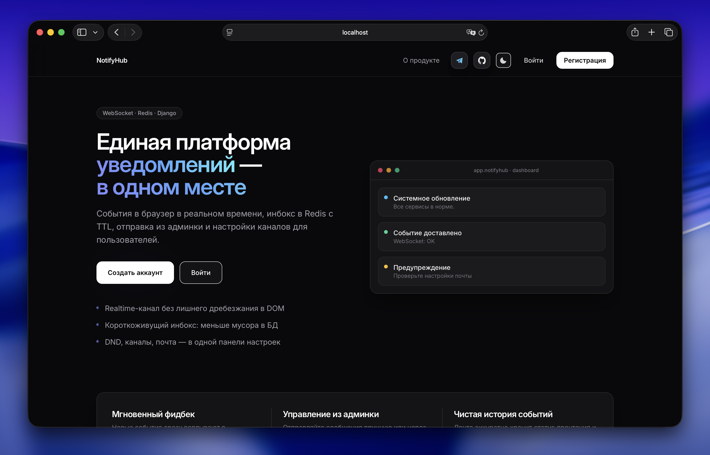
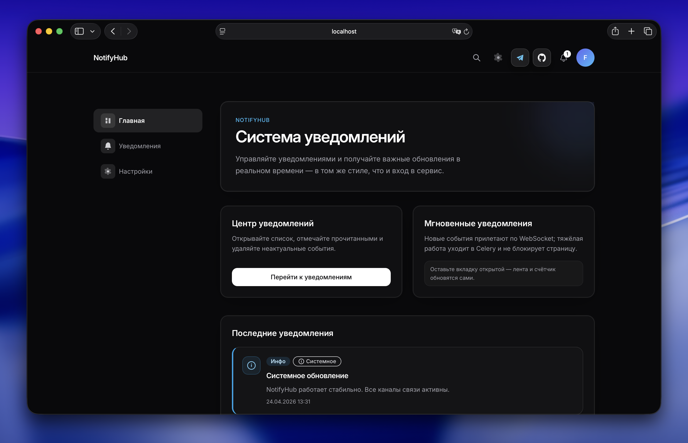

> ***⚠️ This is a study project.***

<div align="center">

<h1>🌀 NotifyHub</h1>

*Modern notification platform with async architecture*

</div>




## ⬇️ Installation

### 🐳 via Docker

#### Install Docker

```bash
sudo curl -fsSL https://get.docker.com | sh
```

#### Clone the repository

```bash
git clone https://github.com/fajox1/notifyhub
cd notifyhub
```


#### 🗂 Configure config variables
```
cp .env.example .env
```

### 🔥 Run (Web + Postgres + Redis + Celery (beat & worker))
```bash
docker compose up -d && docker compose logs -f -t
```

> App is going to be available on **[localhost:8000](http://localhost:8000)**.

## 💻 Local tests without Docker
```bash
bash scripts/test.sh
```

## 📢 Notification sending
### 🚀 via Django Admin
- Open `localhost:8080/admin/core/notification/`
- Click `Send notification`
- Insert `user_id`, `title`, `message`, `level`, `kind`
- By default it sends via Celery (`Send via Celery`)

### ⌨️ via Django shell in Docker Compose
```sh
docker compose exec web python3 -m app shell
```

#### Using Celery (recommended):
```python
from app.core.services import send_notification
task_id = send_notification(
    user_id=1,
    title="Test",
    message="Hello from django shell in docker!",
    level="info",
    use_celery=True,
)
print(task_id)
```

#### Synchronously (without queue):
```python
from app.core.services import send_notification
notification_id = send_notification(
    user_id=1,
    title="This one is synchronously",
    message="Sent without celery.",
    level="success",
    use_celery=False,
)
print(notification_id)
```

*Lisenced under GPL GNU 3.0*